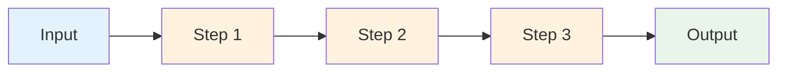

# 🔗 LangChain Chains - Complete Guide

A comprehensive collection of LangChain chain implementations demonstrating how to combine multiple AI operations into powerful workflows.


## 📖 What are LangChain Chains?

**Chains** in LangChain are sequences of operations that work together to accomplish complex tasks. Think of them as assembly lines for AI operations - each step processes the output from the previous step, creating sophisticated workflows.

### 🎯 Why Use Chains?

Chains solve several problems in AI application development:

1. **Complex Workflows**: Break down complex tasks into manageable steps
2. **Reusability**: Create reusable components for different applications
3. **Error Handling**: Handle errors at each step of the process
4. **Debugging**: Easily identify where issues occur in the workflow
5. **Flexibility**: Mix and match different components as needed

## 🏗️ Chain Architecture



## 📁 Chain Types Implemented

### 1. **Simple Chain** 🔗
**File**: `simple_chain.py`

The most basic type of chain - a single operation flow.

```python
# Input → Prompt → Model → Output Parser → Result
chain = template | model | StrOutputParser()
```

**What it does:**
- Takes user input (country name)
- Creates a prompt asking for the capital
- Sends to AI model
- Parses the response
- Returns clean text

**Example Flow:**
```
Input: "India" 
→ Prompt: "What is the capital of India?"
→ AI: "The capital of India is New Delhi."
→ Output: "The capital of India is New Delhi."
```

### 2. **Sequential Chain** ⛓️
**File**: `sequential_chain.py`

Multiple operations executed one after another, where each step uses the output from the previous step.

```python
# Step 1 → Step 2 → Step 3 → Final Result
chain = template1 | model | parser | template2 | model | parser
```

**What it does:**
- First asks for the capital of a country
- Uses that result to ask for the population
- Chains both operations together

**Example Flow:**
```
Input: "India"
→ Step 1: "What is the capital of India?" → "New Delhi"
→ Step 2: "What is the population of India?" → "1.4 billion"
→ Output: "1.4 billion"
```

### 3. **Conditional Chain** 🌿
**File**: `conditional_chain.py`

Makes decisions based on AI output and follows different paths accordingly.

```python
# Classify → Branch → Different Responses
chain = classifier_chain | branch_chain
```

**What it does:**
- Analyzes feedback sentiment (positive/negative)
- Routes to different response templates based on sentiment
- Provides appropriate responses for each case

**Example Flow:**
```
Input: "This is a beautiful phone"
→ Classify: "positive"
→ Branch: Use positive response template
→ Output: "Thank you for your positive feedback!"
```

### 4. **Parallel Chain** ⚡
**File**: `parallel-chains.py`

Executes multiple operations simultaneously and combines their results.

```python
# Parallel Operations → Merge Results
parallel_chain = RunnableParallel({
    'notes': prompt1 | model1 | parser,
    'quiz': prompt2 | model2 | parser
})
```

**What it does:**
- Generates study notes using one AI model
- Creates quiz questions using another AI model
- Runs both operations simultaneously
- Merges results into a single document

**Example Flow:**
```
Input: "SVM text"
→ Parallel: 
  ├── Notes: "SVM is a supervised learning method..."
  └── Quiz: "1. What is SVM? 2. What are its advantages?..."
→ Merge: Combined study material
→ Output: Complete study guide
```

## 🔄 Chain Comparison

| Chain Type | Use Case | Speed | Complexity | Flexibility |
|------------|----------|-------|------------|-------------|
| **Simple** | Basic Q&A | Fast | Low | Low |
| **Sequential** | Multi-step tasks | Medium | Medium | Medium |
| **Conditional** | Decision making | Medium | High | High |
| **Parallel** | Multi-output tasks | Fast | High | High |

## 🚀 Quick Start

### Prerequisites

```bash
# Install required packages
pip install langchain langchain-openai langchain-anthropic python-dotenv pydantic
```

### Environment Setup

Create a `.env` file in the `langchain-chains` directory:

```env
# OpenAI API Key
OPENAI_API_KEY=your_openai_api_key_here

# Anthropic API Key (for Claude)
ANTHROPIC_API_KEY=your_anthropic_api_key_here
```

### Running Examples

```bash
# Simple chain
python simple_chain.py

# Sequential chain
python sequential_chain.py

# Conditional chain
python conditional_chain.py

# Parallel chain
python parallel-chains.py
```

## 🧠 Chain Components Explained

### 1. **Prompt Templates**
```python
template = PromptTemplate(
    template="What is the capital of {country}?",
    input_variables=["country"]
)
```
- Define reusable prompt structures
- Use variables for dynamic content
- Ensure consistent formatting

### 2. **Models**
```python
model = ChatOpenAI()  # OpenAI GPT
model2 = ChatAnthropic()  # Claude
```
- Different AI providers
- Various model capabilities
- Consistent interface across providers

### 3. **Output Parsers**
```python
parser = StrOutputParser()  # Plain text
parser2 = PydanticOutputParser(pydantic_object=Feedback)  # Structured data
```
- Convert AI responses to usable formats
- Validate output structure
- Handle parsing errors

### 4. **Chain Operators**
```python
# Pipe operator for sequential execution
chain = template | model | parser

# Parallel execution
parallel = RunnableParallel({
    'task1': chain1,
    'task2': chain2
})

# Conditional branching
branch = RunnableBranch(
    (condition1, chain1),
    (condition2, chain2),
    default_chain
)
```

## 🎯 Real-World Applications

### 1. **Customer Support System**
```python
# Conditional Chain Example
feedback → sentiment_analysis → appropriate_response
```

### 2. **Content Generation Pipeline**
```python
# Parallel Chain Example
topic → [summary, questions, examples] → combined_content
```

### 3. **Data Processing Workflow**
```python
# Sequential Chain Example
raw_data → clean → analyze → summarize → report
```

### 4. **Educational Tool**
```python
# Parallel Chain Example
lesson_text → [notes, quiz, examples] → study_guide
```

## 🔧 Advanced Chain Patterns

### 1. **Error Handling in Chains**
```python
from langchain.schema.runnable import RunnableLambda

def safe_parse(text):
    try:
        return parser.parse(text)
    except Exception as e:
        return f"Error: {e}"

safe_chain = template | model | RunnableLambda(safe_parse)
```

### 2. **Chain Composition**
```python
# Combine different chain types
complex_chain = (
    parallel_chain | 
    merge_template | 
    model | 
    conditional_branch
)
```

### 3. **Chain Debugging**
```python
# Visualize chain structure
chain.get_graph().print_ascii()

# Add logging
def log_step(input_data):
    print(f"Processing: {input_data}")
    return input_data

logged_chain = RunnableLambda(log_step) | template | model
```

## 📊 Performance Optimization

### 1. **Parallel Execution**
- Use `RunnableParallel` for independent operations
- Reduces total execution time
- Better resource utilization

### 2. **Caching**
```python
from langchain.cache import InMemoryCache
from langchain.globals import set_llm_cache

set_llm_cache(InMemoryCache())
```

### 3. **Streaming**
```python
# Stream responses for better UX
for chunk in chain.stream({"input": "data"}):
    print(chunk)
```

## 🔧 Troubleshooting

### Common Issues

1. **API Key Errors**
   ```bash
   # Check environment variables
   echo $OPENAI_API_KEY
   ```

2. **Chain Execution Errors**
   ```python
   # Add error handling
   try:
       result = chain.invoke(input_data)
   except Exception as e:
       print(f"Chain error: {e}")
   ```

3. **Output Parsing Issues**
   ```python
   # Use safe parsing
   def safe_parse(text):
       try:
           return parser.parse(text)
       except:
           return text  # Return raw text if parsing fails
   ```

4. **Memory Issues**
   ```python
   # Clear chain state
   chain.clear()
   ```

## 🎓 Learning Path

### Beginner (Start Here)
1. **Simple Chain**: Understand basic chain concepts
2. **Sequential Chain**: Learn multi-step workflows
3. **Practice**: Modify examples with your own prompts

### Intermediate
1. **Conditional Chain**: Implement decision-making logic
2. **Error Handling**: Add robust error management
3. **Custom Parsers**: Create domain-specific output parsers

### Advanced
1. **Parallel Chain**: Optimize with concurrent execution
2. **Chain Composition**: Build complex workflows
3. **Custom Components**: Create reusable chain components

## 🚀 Next Steps

### Immediate Actions
1. **Run Examples**: Execute each chain type
2. **Modify Prompts**: Customize for your use cases
3. **Add Error Handling**: Make chains more robust
4. **Experiment**: Try different model combinations

### Advanced Projects
1. **Multi-Model Pipeline**: Use different models for different steps
2. **Dynamic Chains**: Create chains that adapt based on input
3. **Chain Orchestration**: Manage multiple chains in a system
4. **Performance Monitoring**: Track chain execution metrics

## 📚 Additional Resources

### Official Documentation
- [LangChain Chains](https://python.langchain.com/docs/modules/chains/)
- [LangChain Runnable](https://python.langchain.com/docs/expression_language/)
- [LangChain Cookbook](https://github.com/langchain-ai/langchain/tree/master/cookbook)

### Community
- [LangChain Discord](https://discord.gg/langchain)
- [GitHub Discussions](https://github.com/langchain-ai/langchain/discussions)

## 🤝 Contributing

We welcome contributions! Here's how you can help:

1. **Add New Chain Types**: Implement additional chain patterns
2. **Improve Examples**: Make existing examples more robust
3. **Add Documentation**: Help explain complex concepts
4. **Report Issues**: Found a bug? Let us know!

---

**Happy Chaining! 🔗**

Start with simple chains and gradually work your way up to complex parallel and conditional workflows. Each chain type serves different purposes, so choose the right one for your specific use case.

Remember: The power of chains comes from combining simple operations into sophisticated workflows that can handle complex real-world tasks!

---

*Last updated: December 2024*
