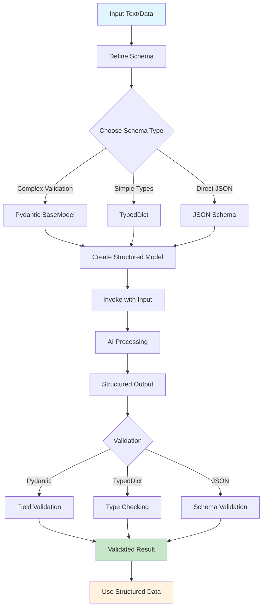

# LangChain Structured Output Examples

This directory contains examples demonstrating different approaches to structured output generation using LangChain. Structured output ensures that AI models return data in a predictable, validated format.

## Overview

Structured output allows you to define a schema for the data you want to extract from AI models, ensuring consistent and reliable results. This is particularly useful for:
- Data extraction from text
- API responses
- Database operations
- Content analysis

## Examples Included

### 1. Pydantic Demo (`pydantic_demo.py`)
**Purpose**: Basic Pydantic model demonstration
- Shows how to create a `Student` model with validation
- Demonstrates field validation (CGPA between 0-10)
- Includes email validation using `EmailStr`
- Shows model serialization to JSON

### 2. Structured Output with Pydantic (`with_structured_output_pydantic.py`)
**Purpose**: AI-powered review analysis using Pydantic
- Uses `BaseModel` to define a `Review` schema
- Extracts key themes, summary, sentiment, pros/cons from product reviews
- Demonstrates `Literal` types for constrained values
- Shows optional fields with defaults

### 3. Structured Output with TypedDict (`with_structured_output_typeddict.py`)
**Purpose**: Same functionality as Pydantic but using TypedDict
- Uses `TypedDict` for type hints
- Uses `Annotated` for field descriptions
- Lighter weight alternative to Pydantic
- Good for simple schemas without complex validation

### 4. Type Dictionary Utility (`typedict.py`)
**Purpose**: Helper utilities for type management
- Maps string type names to Python types
- Provides functions to get and set variable types
- Useful for dynamic type handling

## Key Concepts

### Schema Definition
- **Pydantic**: Uses `BaseModel` with field validation and serialization
- **TypedDict**: Uses type hints with `Annotated` for descriptions
- **JSON Schema**: Direct JSON schema definition (referenced in `with_structured_output_json.py`)

### Field Types
- `str`: Text fields
- `list[str]`: Lists of strings
- `Optional[type]`: Optional fields that can be None
- `Literal["value1", "value2"]`: Constrained to specific values
- `Annotated[type, "description"]`: Type with description

### Validation Features
- **Pydantic**: Built-in validation, error handling, serialization
- **TypedDict**: Type checking only, no runtime validation
- **Field Descriptions**: Guide AI model on what to extract

## Workflow Process



## Benefits

1. **Consistency**: Always get data in expected format
2. **Validation**: Automatic type checking and validation
3. **Documentation**: Schema serves as documentation
4. **Error Handling**: Clear error messages for invalid data
5. **Integration**: Easy to integrate with databases and APIs

## Usage Tips

- Use **Pydantic** for complex validation needs
- Use **TypedDict** for simple type hints
- Always provide clear field descriptions
- Use `Optional` for fields that might not be present
- Leverage `Literal` for constrained values
- Test your schemas with sample data

## Quick Start

```python
from langchain_openai import ChatOpenAI
from pydantic import BaseModel, Field

# Define schema
class MySchema(BaseModel):
    field1: str = Field(description="What to extract")
    field2: Optional[int] = Field(default=None)

# Create structured model
model = ChatOpenAI()
structured_model = model.with_structured_output(MySchema)

# Use it
result = structured_model.invoke("Your input text here")
print(result.field1)  # Access structured data
```

Each example demonstrates a different approach to structured output, helping you choose the best method for your specific use case.
