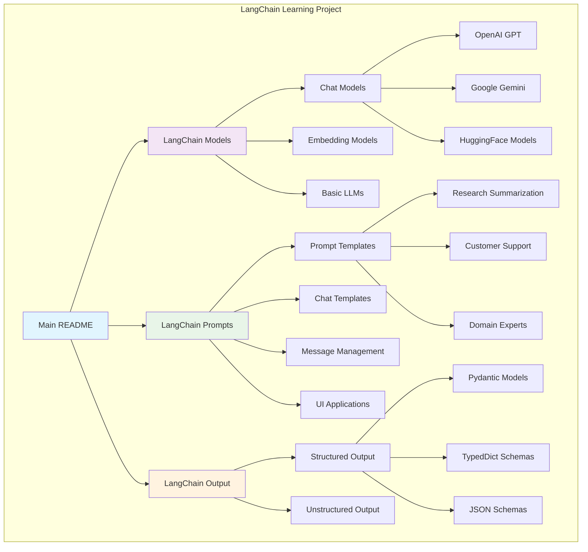
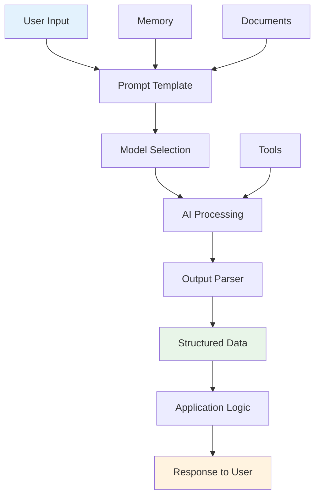

# 🚀 LangChain Learning Journey

A comprehensive collection of LangChain implementations demonstrating various AI/ML concepts, from basic LLM integrations to advanced prompt engineering and structured output generation.


## 📖 What is LangChain?

**LangChain** is a powerful framework for building applications with Large Language Models (LLMs). Think of it as a toolkit that makes it easier to:

- **Connect** different AI models (OpenAI, Google Gemini, HuggingFace, etc.)
- **Chain** multiple AI operations together
- **Manage** conversations and memory
- **Process** documents and data
- **Create** structured outputs from unstructured text

### 🎯 Why Learn LangChain?

LangChain solves common problems in AI application development:

1. **Model Switching**: Easily switch between different AI providers
2. **Prompt Management**: Organize and reuse prompts effectively
3. **Data Processing**: Handle documents, web content, and structured data
4. **Memory Management**: Maintain conversation context
5. **Output Control**: Get structured, reliable responses from AI models

## 🏗️ Project Architecture




## 🚀 Quick Start Guide

### 1. Prerequisites

- Python 3.8 or higher
- OpenAI API key (for GPT models)
- Google API key (for Gemini models)
- HuggingFace account (for HF models)

### 2. Installation

```bash
# Clone the repository
git clone <your-repo-url>
cd langchain

# Create virtual environment
python -m venv venv

# Activate virtual environment
# Windows:
venv\Scripts\activate
# macOS/Linux:
source venv/bin/activate

# Install dependencies for each module
cd langchain-models
pip install -r requirements.txt

cd ../langchain-promts
pip install -r requirements.txt
```

### 3. Environment Setup

Create a `.env` file in each module directory:

```env
# OpenAI API Key
OPENAI_API_KEY=your_openai_api_key_here

# Google API Key (for Gemini)
GOOGLE_API_KEY=your_google_api_key_here

# HuggingFace Token (optional)
HUGGINGFACE_API_TOKEN=your_hf_token_here
```

### 4. Run Your First Example

```bash
# Basic chatbot
cd langchain-promts
python chatbot.py

# Web interface
streamlit run promt_ui.py

# Structured output demo
cd ../langchain-output/structured_output
python with_structured_output_pydantic.py
```

## 🧠 Core LangChain Concepts

### 1. **Models** 🤖

LangChain provides a unified interface for different AI models:

```python
from langchain_openai import ChatOpenAI
from langchain_google_genai import ChatGoogleGenerativeAI

# OpenAI GPT
openai_model = ChatOpenAI(model="gpt-4", temperature=0.7)

# Google Gemini
gemini_model = ChatGoogleGenerativeAI(model="gemini-pro")
```

**Key Benefits:**
- Switch between providers easily
- Consistent API across different models
- Built-in parameter management

### 2. **Prompts** 💬

Structured prompt templates for consistent AI interactions:

```python
from langchain_core.prompts import ChatPromptTemplate

template = ChatPromptTemplate.from_messages([
    ("system", "You are a helpful {role}"),
    ("human", "Explain {topic} in simple terms")
])

prompt = template.format_messages(role="teacher", topic="machine learning")
```

**Key Benefits:**
- Reusable prompt patterns
- Variable substitution
- Role-based conversations

### 3. **Chains** 🔗

Combine multiple operations into workflows:

```python
from langchain_core.chains import LLMChain

chain = LLMChain(llm=model, prompt=template)
result = chain.run(topic="artificial intelligence")
```

**Key Benefits:**
- Complex workflow management
- Error handling
- Debugging capabilities

### 4. **Memory** 🧠

Maintain conversation context:

```python
from langchain.memory import ConversationBufferMemory

memory = ConversationBufferMemory()
memory.save_context({"input": "Hello"}, {"output": "Hi there!"})
```

**Key Benefits:**
- Context preservation
- Multi-turn conversations
- Personalized interactions

### 5. **Output Parsers** 📊

Structure AI responses into usable data:

```python
from pydantic import BaseModel, Field

class Person(BaseModel):
    name: str = Field(description="Person's name")
    age: int = Field(description="Person's age")

structured_model = model.with_structured_output(Person)
result = structured_model.invoke("John is 25 years old")
```

**Key Benefits:**
- Consistent data format
- Type validation
- Easy integration with databases

## 📚 Learning Modules

### 🤖 Module 1: LangChain Models

**What you'll learn:**
- Different AI model integrations
- Embedding models for similarity search
- Model parameter tuning
- API key management

**Key Files:**
- `chatmodels/1_openai.py` - OpenAI GPT integration
- `chatmodels/gemini.py` - Google Gemini setup
- `embeddingModels/embedding_openai.py` - Text embeddings
- `llms/basic.py` - Simple LLM usage

**Example Use Case:**
```python
# Multi-model chatbot
from langchain_openai import ChatOpenAI
from langchain_google_genai import ChatGoogleGenerativeAI

def get_response(provider, message):
    if provider == "openai":
        model = ChatOpenAI(model="gpt-4")
    elif provider == "gemini":
        model = ChatGoogleGenerativeAI(model="gemini-pro")
    
    return model.invoke(message)
```

### 💬 Module 2: LangChain Prompts

**What you'll learn:**
- Prompt template creation
- Message management
- Conversation flow
- Web interface development

**Key Files:**
- `chatbot.py` - Interactive CLI chatbot
- `promt_ui.py` - Streamlit web interface
- `chat_promt_template.py` - Advanced templates
- `message_placeholder.py` - Context management

**Example Use Case:**
```python
# Research paper summarizer
template = ChatPromptTemplate.from_template("""
Summarize this research paper: {paper_title}
Style: {style}
Length: {length}

Paper content: {content}
""")

chain = template | model
result = chain.invoke({
    "paper_title": "AI in Healthcare",
    "style": "academic",
    "length": "brief",
    "content": paper_text
})
```

### 📊 Module 3: LangChain Output

**What you'll learn:**
- Structured data extraction
- Output validation
- Schema definition
- Data processing

**Key Files:**
- `structured_output/with_structured_output_pydantic.py` - Pydantic validation
- `structured_output/with_structured_output_typeddict.py` - TypedDict schemas
- `unstructured_output/demo.py` - Raw text processing

**Example Use Case:**
```python
# Product review analyzer
class ReviewAnalysis(BaseModel):
    sentiment: Literal["positive", "negative", "neutral"]
    key_themes: List[str]
    summary: str
    pros: List[str]
    cons: List[str]

structured_model = model.with_structured_output(ReviewAnalysis)
analysis = structured_model.invoke(customer_review_text)
```

## 🔄 LangChain Workflow



## 🎯 Real-World Applications

### 1. **Customer Support Bot**
- **Problem**: Handle customer inquiries efficiently
- **Solution**: LangChain chatbot with conversation memory
- **Files**: `langchain-promts/message_placeholder.py`

### 2. **Research Assistant**
- **Problem**: Summarize complex research papers
- **Solution**: Structured prompts with customizable output
- **Files**: `langchain-promts/promt_ui.py`

### 3. **Data Extraction Tool**
- **Problem**: Extract structured data from unstructured text
- **Solution**: Pydantic models with validation
- **Files**: `langchain-output/structured_output/`

### 4. **Multi-Model Comparison**
- **Problem**: Compare different AI model outputs
- **Solution**: Unified LangChain interface
- **Files**: `langchain-models/chatmodels/`

## 🛠️ Advanced Features

### Document Processing
```python
from langchain_community.document_loaders import WebBaseLoader
from langchain_text_splitters import RecursiveCharacterTextSplitter

# Load and split documents
loader = WebBaseLoader("https://example.com")
documents = loader.load()
splitter = RecursiveCharacterTextSplitter(chunk_size=1000)
chunks = splitter.split_documents(documents)
```

### Vector Stores
```python
from langchain_openai import OpenAIEmbeddings
from langchain_chroma import Chroma

# Create vector store
embeddings = OpenAIEmbeddings()
vectorstore = Chroma.from_documents(chunks, embeddings)

# Similarity search
results = vectorstore.similarity_search("query text")
```

### Agents
```python
from langchain.agents import create_openai_functions_agent
from langchain.tools import Tool

# Create agent with tools
tools = [Tool(name="search", func=search_function, description="Search the web")]
agent = create_openai_functions_agent(model, tools, prompt)
```

## 📈 Best Practices

### 1. **Prompt Engineering**
- Be specific and clear in instructions
- Use examples to guide the model
- Test prompts with different inputs
- Iterate and refine based on results

### 2. **Error Handling**
```python
try:
    response = model.invoke(prompt)
except Exception as e:
    print(f"Error: {e}")
    # Fallback logic
```

### 3. **Performance Optimization**
- Use appropriate model sizes for tasks
- Implement caching for repeated requests
- Batch operations when possible
- Monitor API usage and costs

### 4. **Security**
- Never expose API keys in code
- Use environment variables
- Implement rate limiting
- Validate all inputs

## 🔧 Troubleshooting

### Common Issues

1. **API Key Errors**
   ```bash
   # Check environment variables
   echo $OPENAI_API_KEY
   ```

2. **Import Errors**
   ```bash
   # Install missing packages
   pip install langchain-openai
   ```

3. **Model Not Found**
   ```python
   # Check available models
   from langchain_openai import ChatOpenAI
   model = ChatOpenAI(model="gpt-3.5-turbo")  # Use available model
   ```

4. **Memory Issues**
   ```python
   # Clear conversation history
   memory.clear()
   ```

## 🚀 Next Steps

### Immediate Learning Path
1. **Start with Models**: Run basic examples in `langchain-models/`
2. **Explore Prompts**: Try the chatbot in `langchain-promts/`
3. **Structured Output**: Experiment with data extraction
4. **Build Something**: Create your own application

### Advanced Topics
- **Agents**: Autonomous AI systems
- **Vector Stores**: Semantic search
- **Document Processing**: PDF, web scraping
- **Memory Management**: Long-term conversation storage
- **Custom Tools**: Extend LangChain functionality

### Project Ideas
- **Personal Assistant**: Schedule management, reminders
- **Content Generator**: Blog posts, social media
- **Data Analyzer**: CSV processing, insights
- **Code Reviewer**: Automated code analysis
- **Language Tutor**: Interactive learning

## 📚 Additional Resources

### Official Documentation
- [LangChain Docs](https://python.langchain.com/)
- [LangChain Hub](https://smith.langchain.com/)
- [LangChain Templates](https://github.com/langchain-ai/langchain/tree/master/templates)

### Community
- [LangChain Discord](https://discord.gg/langchain)
- [GitHub Discussions](https://github.com/langchain-ai/langchain/discussions)
- [Stack Overflow](https://stackoverflow.com/questions/tagged/langchain)

### Tutorials
- [LangChain YouTube Channel](https://www.youtube.com/@LangChain)
- [LangChain Cookbook](https://github.com/langchain-ai/langchain/tree/master/cookbook)

## 🤝 Contributing

We welcome contributions! Here's how you can help:

1. **Report Issues**: Found a bug? Let us know!
2. **Suggest Features**: Have ideas for improvements?
3. **Add Examples**: Share your LangChain implementations
4. **Improve Documentation**: Help others learn better

### Development Setup
```bash
# Fork the repository
git clone <your-fork-url>
cd langchain

# Create feature branch
git checkout -b feature/your-feature-name

# Make changes and test
python -m pytest tests/

# Commit and push
git commit -m "Add your feature"
git push origin feature/your-feature-name
```

## 📄 License

This project is licensed under the MIT License - see the [LICENSE](LICENSE) file for details.

## 🙏 Acknowledgments

- **LangChain Team**: For creating this amazing framework
- **OpenAI**: For providing powerful AI models
- **Google**: For Gemini and other AI tools
- **HuggingFace**: For open-source model access
- **Community**: For continuous support and contributions

---

**Happy Learning! 🎉**

Start with the basics in `langchain-models/`, then explore prompts and structured output. Each module builds upon the previous one, creating a comprehensive understanding of LangChain's capabilities.

Remember: The best way to learn LangChain is by building something useful. Pick a problem you want to solve and use these examples as your starting point!

---

*Last updated: December 2024*
